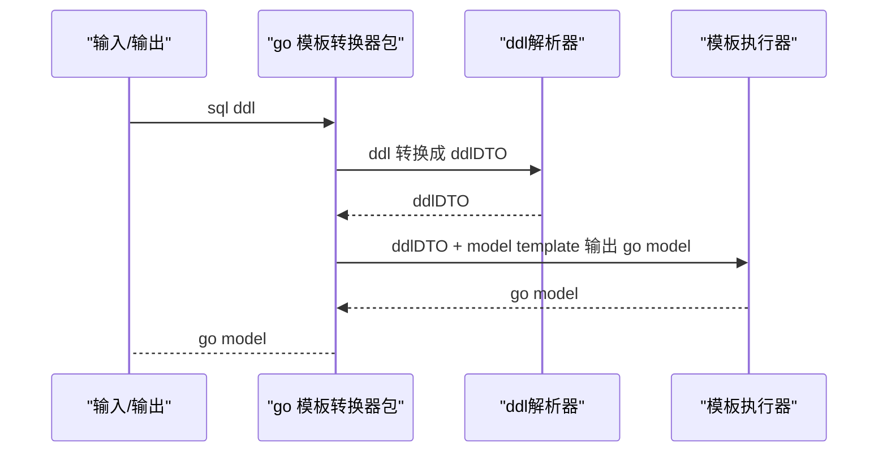
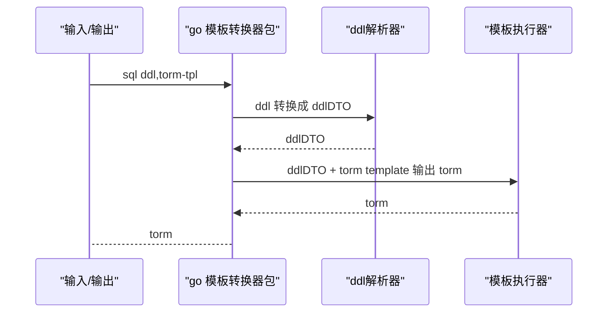
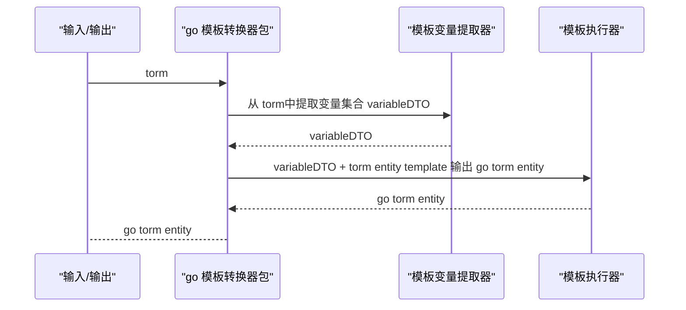
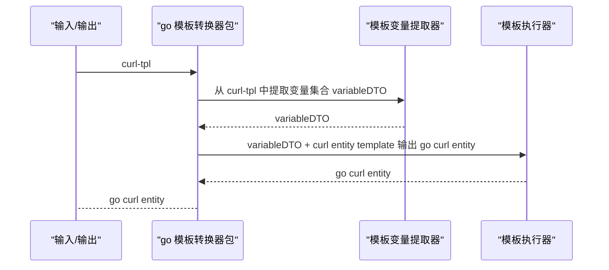

# go 模板转换器
将事务的一种表达形式转换成另外一种表达形式。当前支持以下格式转换
1. sql ddl + model-tpl 转换成go model
2. sql ddl + torm-tpl 转换成 torm
3. torm 转换成 go torm-entity
4. curl-tpl 转换成 go curl-entity

名词解释：
**torm** 基于go text/template 实现拼接sql语句的sql生成器，用于取代orm
**torm-tpl** 基于 go text/template + ddl 实现批量生成torm 的模板，主要用于简化不同数据表相似操作的torm配置(如:crud操作的torm)
**torm-entity** 从 torm 中提取变量作为结构体属性生成的go结构体,主要用于在代码中将参数输入转换为sql语句
**curl-tpl** http请求协议+go text/template ,将数据填充到模板后输出http请求协议文本
**curl-entity** 从curl-tpl中提取变量生成结构体，用于在代码中将输入参数转换为http请求对象

**需求分析**
上叙转换需求，重点有3个：
1. 从go text/template 中提取变量名
2. sql ddl 转json(或者固定格式的dto go结构体)
3. 模板+数据 输出目标结构
其中 1,2 是难点
解决第一个重点后，即可使用变量集合+entity 模板，生成目标entity(torm-entity,curl-entity)
解决第二个重点后，即可使用字段变量结合+模板，生成目标model或者torm

**系统架构**
1. ddl 生成 go model

2. ddl 生成 crud 等通用 torm

3. torm 生成 torm-entity

4. curl-tpl 生成 curl-entity

